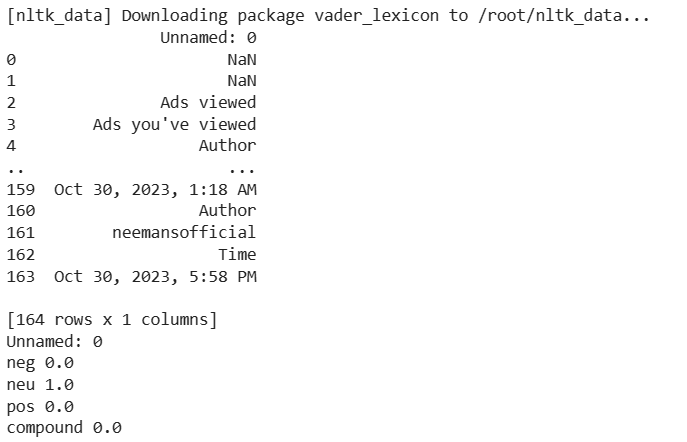

# Implementation of Sentimental Analysis

The process of sentiment analysis using VADER model can be described as follows:

1. Read the input text: The first step is to read the input text. This can be done using a variety of methods, such as reading a file, receiving input from a user, or scraping text from a website.
2. Clean the text: Once the text has been read, it is important to clean it. This involves removing any punctuation, stop words, or other noise that could interfere with the sentiment analysis process.
3. Calculate the sentiment scores: The next step is to calculate the sentiment scores for the text. This is done by using a sentiment analysis model, such as VADER.
4. Interpret the results: The final step is to interpret the results of the sentiment analysis. This involves understanding the meaning of the sentiment scores and how they relate to the text.

VADER is a lexicon- and rule-based sentiment analysis tool that is specifically designed to work with social media text. It is a free and open-source tool that can be used to analyze text in a variety of languages. VADER is a popular choice for sentiment analysis because it is easy to use and produces accurate results.

## Program:
```python3
import nltk
import pandas as pd
from nltk.sentiment.vader import SentimentIntensityAnalyzer
nltk.downloader.download('vader_lexicon')
file='instagram.xlsx'
xl=pd.ExcelFile(file)
dfs=xl.parse(xl.sheet_names[0])
# dfs=list(dfs['Timeline'])
print(dfs)
sid=SentimentIntensityAnalyzer()
str1='UTC+05:30'
for data in dfs:
  a=data.find(str1)
  if(a==-1):
    ss=sid.polarity_scores(data)
    print(data)
    for k in ss:
      print(k,ss[k])
```

## Output:


